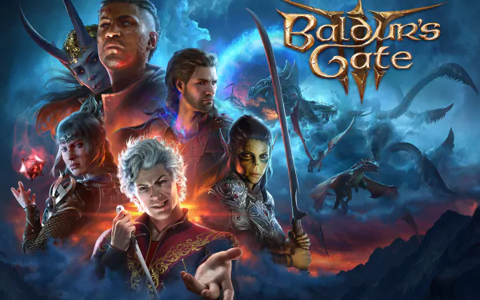

# consolidation
# Ma Collection de jeux

Ce projet a pour objectif de créer une collection de jeux en utilisant JavaScript. Chaque jeux possède des propriétés telles que le titre, la date de sortie, la boite développeur, etc.

## Comment Exécuter

La page est déployer à l'adresse : 
[https://v-alex-dev.github.io/consolidation/](My-site)

## Structure des Fichiers

- `index.html`: Le fichier HTML principal pour afficher la collection.
- `gameData.js`: Le fichier JavaScript contenant la collection de films.
-  `Tailwind`: est le framework utiliser pour le stule.

## Auteur
[Vens Alexandre]

## Licence

Pas de lincense pour le monment
---

## Collection de Films

Voici un exemple de jeux que vous pouvez trouver dans cette collection :

1. **The Shawshank Redemption**
   - **Date de Sortie**: 2023
   - **Developpeur**: Larian Studios
   - **Plateforme**: Playstation 5, Mac, Windows
   - **Genres**: RPG, Adventure, Strategy
   - **Image**:
   

